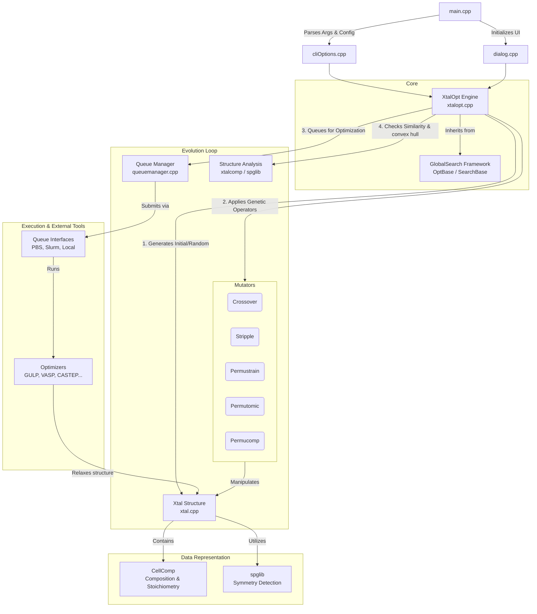

# XtalOpt Architecture Overview

XtalOpt is an evolutionary algorithm for crystal structure prediction, built on top of the **GlobalSearch** generic optimization framework. It operates by maintaining a pool of crystal structures (`Xtal` objects), optimizing their geometries using external tools (like GULP or VASP), and generating new structures via genetic mutations.

Here is a high-level graph of the main components and how they interact during a typical run.

## 1. The Entry Point and Configuration
* **`main.cpp`**: The program entry point. Depending on the arguments, it either launches the Qt GUI or reads the `xtalopt.in` configuration via the command-line interface.
* **`cliOptions.cpp`**: Parses the `xtalopt.in` key-value pairs (like `chemicalFormulas`, `minAtoms`, optimizer settings) and populates the settings in the core engine.

## 2. The Core Engine (`xtalopt.cpp` / `xtalopt.h`)
The `XtalOpt` class is the central coordinator of the evolutionary algorithm. It dictates the main loop:
1. **Initialization**: Creates random starting structures based on the allowed compositions (`CellComp`) and volume constraints.
2. **Evolution Loop**: Constantly checks if the pool of running optimizations is below the user-defined limit. If so, it picks parent structures from the pool (usually based on fitness/enthalpy) and applies genetic operators to create offspring.
3. **Validation**: Before accepting an offspring, it validates its stoichiometry and ensures atoms aren't placed too closely together using atomic radii limits.

## 3. Genetic Operators (`genetic.cpp`)
When the engine needs a new structure, it calls static methods in `XtalOptGenetic` to mutate parents:
* **Crossover**: Slices two parent crystals and combines them.
* **Stripple**: Applies a sine wave perturbation to atomic coordinates.
* **Permustrain**: Modifies the lattice vectors (cell shape).
* **Permutomic**: Swaps the positions of different atomic species.
* **Permucomp** (Variable Composition only): Mutates the stoichiometry by swapping whole formula blocks.

## 4. Execution Pipeline (Optimizers & Queues)
Because DFT (Density Functional Theory) optimizations are computationally expensive, XtalOpt offloads this work:
* **Optimizers (`optimizers/`)**: Classes that know how to write input files (e.g., `POSCAR`/`INCAR` for VASP, `.gin` for GULP) and read the output energies/forces.
* **Queue Interfaces (`queueinterfaces/`)**: Manages the actual submission of these optimizer tasks, whether it's running locally on your laptop or submitting batch jobs to a remote Slurm cluster via SSH.

## 5. Crystal Representation (`xtal.cpp`)
* **`Xtal`**: Represents a physical crystal. It stores the lattice vectors, atomic positions, enthalpy, and space group.
* **`CellComp`**: Handles the underlying composition (e.g., how many Li, Mn, O atoms are present). This is what we were modifying earlier to support USPEX-style variable blocks.
* **External Libs**: XtalOpt heavily relies on `spglib` (to detect space groups and symmetries) and `XtalComp` / `OBConvert` for structure comparisons (to ensure we don't keep duplicate crystals in the pool).
